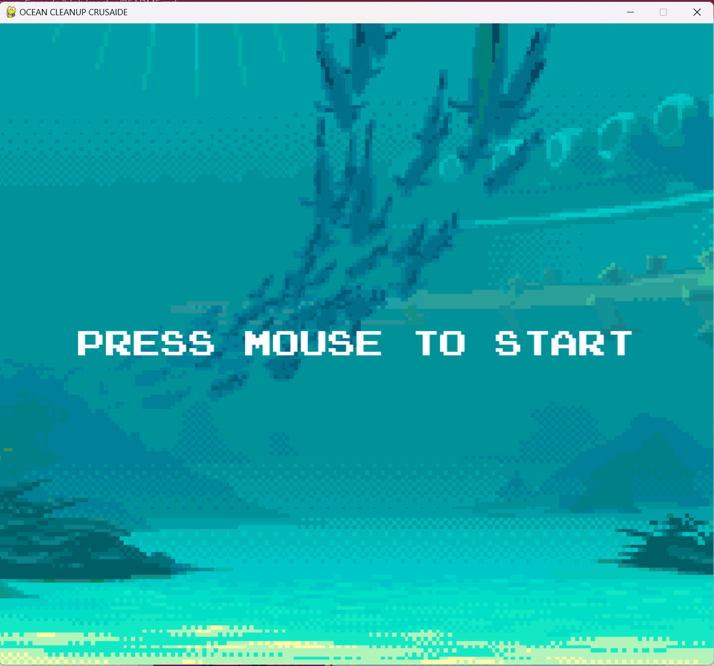
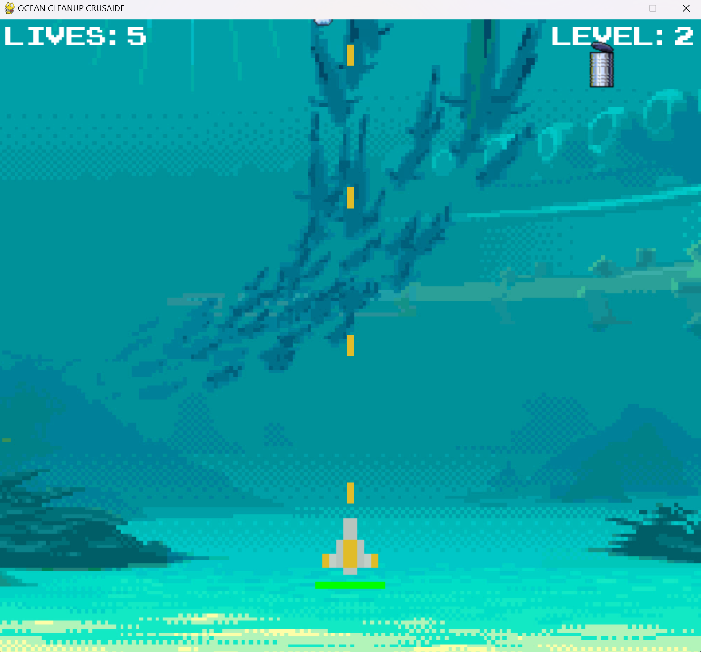
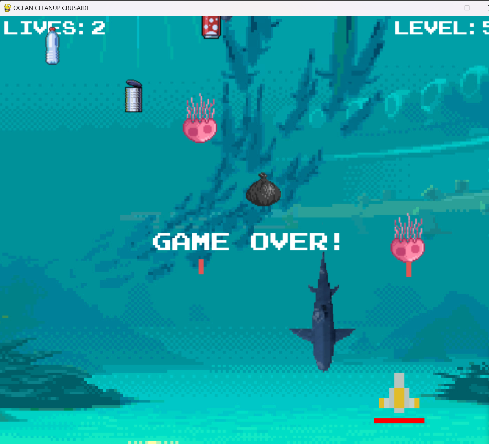

# Ocean-Cleanup-Crusade
Game Title: Ocean Cleanup Crusade, Dive into the heart of the "Ocean Cleanup Crusade," a thrilling remake that fuses the excitement of a marine adventure with a crucial mission to restore the world's oceans.

  

  

  <strong>Ocean Cleanup Crusade</strong>

---
## 🌟Introduction 

Dive into the heart of the "Ocean Cleanup Crusade," a thrilling remake that fuses the excitement of a marine adventure with a crucial mission to restore the world's oceans. Immerse yourself in a vibrant and dynamic underwater realm, where you, as the guardian of the sea, confront formidable challenges to rid the ocean of pollution and safeguard its inhabitants.

---
## 🎮Features

Join Ocean Cleanup Crusade, the action-packed game where you combat marine pollution, face diverse enemies, and save the oceans with strategic laser battles!

- #### 1. Environmental Mission:
  - 🌊 Experience the excitement of a space shooter game with an environmental twist.
  - 🌊  Battle against various types of marine debris, from trash bags to soda cans, and even face off against formidable sea creatures like sharks and jellyfish.🦈

- #### 2. Intuitive Controls:
  - 🕹️ Seamlessly navigate your ship through the aquatic challenges using simple arrow key controls.⬅️➡️
  - 🚀 Command your ship to shoot lasers at oncoming threats with the press of the space bar.

- #### 3. Dynamic Enemies:
  - 🐙 Encounter a diverse array of enemies, each with unique behaviors and attack patterns.
  - 🚨 Defend against relentless waves of pollution as you progress through multiple levels.

- #### 4. Laser Showdown:
  - 🔥 Engage in intense laser battles with enemies as you strategically avoid their attacks.
  - 🎮 Wield powerful lasers to obliterate the source of ocean pollution.

- #### 5. Level Progression:
  - 🎮 Challenge your skills across different levels, each presenting new obstacles and enemies.
  - 🏆 Overcome waves of pollution and advance through the game to become the ultimate Ocean Cleanup Crusader.

- #### 6. Arcade-style Graphics:
  - 🎨  Enjoy retro-inspired pixel art for ships, lasers, and enemies, adding a nostalgic touch to the gaming experience. cahnge the icons related to the each description

---

## 🎮👀Gameplay Preview

Dive into the realm of "Ocean Cleanup Crusade" through our gameplay preview, showcasing engaging activities such as battling marine debris, strategically using lasers to combat pollution, and fostering a connection with the virtual ocean. Experience the thrill of contributing to a cleaner and safer aquatic environment!

  
  
  

---
## 🌏Sustainable Development Goals (SDGs) 

Embark on an exciting virtual journey with "Ocean Cleanup Crusade," a thrilling Python game that not only entertains but also raises awareness about the United Nations' Sustainable Development Goals (SDGs). Let's delve into how this game aligns with various SDGs:

- **SDG 14 - Life Below Water:**

🎮 Dive into the virtual ocean to combat marine pollution and protect underwater ecosystems.Battle against diverse enemies, including sharks and jellyfish, symbolizing the need to preserve marine biodiversity.

- **SDG 6 - Clean Water and Sanitation:**

SDG 3 aims to ensure healthy lives and well-being for all, including animals. The health and well-being of animals are crucial not only for their welfare but also for human health. Healthy animals, often considered man's best friend, contribute to our emotional well-being. In summary, achieving Good Health and Well-Being involves promoting animal health through disease prevention, vaccination, proper nutrition, and access to veterinary care, all of which are vital.

- **SDG 13 - Climate Action:**

SDG 12 focuses on sustainable consumption and production patterns, with an emphasis on reducing food waste. Addressing food waste is crucial for responsible consumption and production related to animals, as significant amounts are lost at various supply chain stages. Advocating for measures to reduce food waste encourages responsible consumption, optimizing resources in feed production, and minimizing environmental impacts linked to waste disposal.

- **SDG 15: Life on Land 🌳**

SDG 15 aims to protect, restore, and sustainably use terrestrial ecosystems, including measures for Human-Animal Conflict Mitigation. Strategies to reduce conflicts between humans and animals, such as establishing corridors and employing non-lethal methods for domestic management, minimize negative interactions. Protecting and nurturing life on land, including animal species, is vital for the health and sustainability of terrestrial ecosystems, contributing to the overall achievement of SDG 15.

---
## 🎥🌟Video Presentation

 Embark on a thrilling journey with "Ocean Cleanup Crusade" in our captivating video presentation. Battle marine pollution, face formidable enemies, and strategically eliminate ocean debris. This game goes beyond entertainment, emphasizing environmental awareness and sustainability. Join the crusade, save the oceans, and experience the ultimate gaming adventure! 🌊🎮

  <a href="https://drive.google.com/file/d/1toJMIbcGxM8GDsynznatAmTwrbpRzF96/view" target="_blank">OCEAN CLEANUP CRUSADE</a>

---
## 👥Meet the Team
Meet the dedicated minds behind "Ocean Cleanup Crusade," where passion meets purpose. Explore the creative forces shaping our mission to raise environmental awareness through gaming. Join us in the crusade for cleaner oceans and a transformative gaming experience! 🌊🕹️

 

  

  MACARAIG, WINONA ASHLEY L.

  21-04058@g.batstate-u.edu.ph

  Contributions (50%): Programmer, Video Presentation, Documentation (README)

 

  

  MALANGIS, RONA

  21-59605@g.batstate-u.edu.ph

  Contributions (25%): Programmer

 

  

  MACALALAD, DIANALYN

  21-072232-03152@g.batstate-u.edu.ph

  Contributions (25%): Programmer

---
## 📊Self-Assessment

  As the Ocean Cleanup Crusade team, we've conducted a comprehensive self-assessment of our project, considering various criteria essential for its success. Below are the ratings reflecting our evaluation:

- **Code Reusability:**  ⭐⭐⭐⭐
- **Maintainability:** ⭐⭐⭐⭐
- **Scalability:** ⭐⭐⭐
- **Execution:** ⭐⭐⭐⭐
- **Originality:** ⭐⭐⭐⭐
- **Overall Impression:** ⭐⭐⭐⭐

  These ratings provide an evaluation of the project's performance across key dimensions. We are committed to ongoing improvement and highly value your suggestions for enhancing future iterations. Your feedback plays a crucial role in refining our project and making it even better. Thank you for your insights!

  
Thank you for joining the Ocean Cleanup Crusade! Your participation is instrumental in making a positive impact on our virtual journey to clean the oceans.

